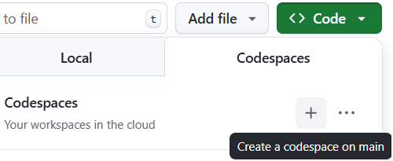

# Rust for Data Science

This is a guide for Data Scientists and Machine Learning learners that seek to learn **Rust** from scratch alongside with **Cargo**, its package manager tool, and **PyO3**, a Rust library that gives developers a direct access to manually written Rust functions from Python files with simple imports.

This guide is divided in four parts : 
1. [**Basics of Rust**](./docs/rust.md)
2. [**Basics of Cargo**](./docs/cargo.md)
3. [**How to use PyO3**](./docs/pyo3.md)
4. [**Applications and tests**](./docs/applications.md)

## You are in the `TODO_hard` branch

To check the **Applications** correction, you must go to the `main` branch with :
```bash
git switch main
```

In the `TODO` branch, certain files contain a TODO section that you must fill.

## Option 1 — Local Setup (VSCode/Cursor)


### Clone project
```bash
git clone git@github.com:jinchengluo/rust_for_data_science.git
```

### Install Rust and Cargo
```bash
curl --proto '=https' --tlsv1.2 https://sh.rustup.rs -sSf | sh
```

Check with `rustc --version` and `cargo --version`

### Install uv
```bash
curl -LsSf https://astral.sh/uv/install.sh | sh
```

### Create `.venv`
```bash
uv venv # at the root of the repo
source .venv/bin/activate
```

### Install dependencies
```bash
uv sync
```

## Option 2 — Cloud Setup (GitHub Codespaces)

For a zero-installation experience directly in your browser:

1. Go to the repository on GitHub
2. Select your desired branch (`main`, `TODO_easy`, etc.)
3. Click the green "Code" button → "Create codespace"
4. Once the Codespace loads, run:
   ```bash
   uv sync
   source .venv/bin/activate
   ```
   You're now ready to start coding!

> **Important**: Each Codespace is tied to the branch you selected when creating it. To switch branches, go back to GitHub, select the new branch, and click on the + icon in the top right corner to create a new Codespace for that branch then repeat step 4.

<p align="center">
  
</p>
