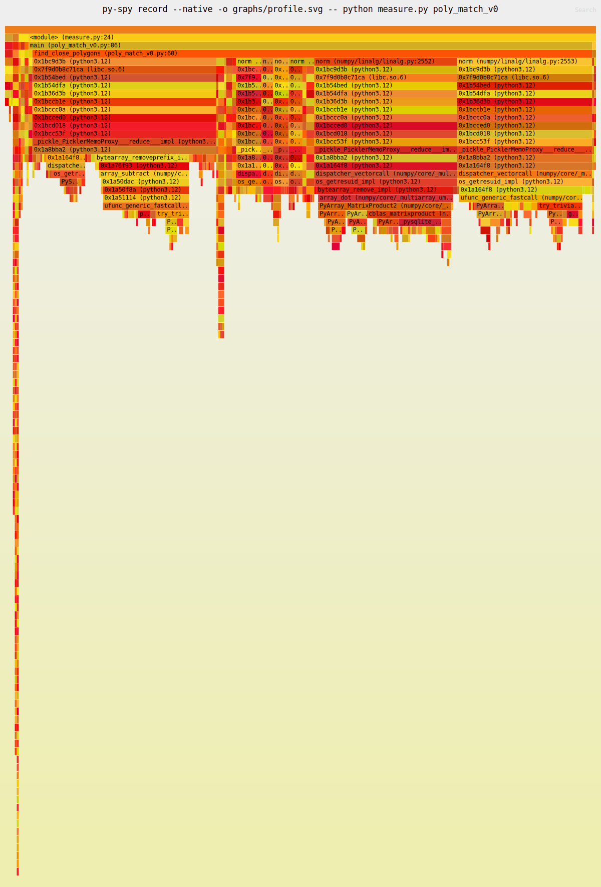

1. [Polygon](#polygon)
    - [Context](#context)
    - [Tests and mesures](#tests-and-measures)
    - [Sampling analysis](#sampling-analysis)
    - [Exercice](#exercice)
2. [ML demos](#ml-demos)


# Polygon 

Beforehand, I want to thanks `ohadravid`'s [work](https://ohadravid.github.io/posts/2023-03-rusty-python/) from which this exercice is from.

Let's now put in practice your skills in Python, Rust and PyO3. 

Go to `poly_match_rs` and activate your virtual environnement from the root of the project (at `rust_for_data_science/.`):
```bash
source .venv/bin/activate
```

** Don't forget to install the Python dependencies after activating your venv with `uv pip install requierments.txt`

## Context 

Imagine you have a list of polygons and a of list points, all in 2D. For business reasons, we want to “match” each point to a single polygon.

Our imaginary library is going to:

- Start with an initial list of points and polygons (all in 2D).
- For each point, find a much smaller subset of polygons that are closest to it, based on distance from the center.
- Out of those polygons, select the “best” one (we are going to use “smallest area” as “best”).

You will find in in the file `py_project/poly_match_v0.py` the baseline of our Python project that we want to optimize. The objective is now to speedup as much as possible by replacing some portions of code in Rust.

## Tests and measures

In order to check if the replaced code optimizes well, we will need a measurement tool. For that, there are two Python files already written that records the average time a version of the `poly_match` code takes.

- You will find `measure.py` that does the job only for one version :
```bash
python3 measure.py <module_name>
```

Where `<module_name>` refers to a version of the code and will be in the form `

## Sampling analysis

Use `py-spy` ([GitHub](https://github.com/benfred/py-spy)) to analyse the time each function and subfunction takes. `py-spy` is a [sampling profiler](https://en.wikipedia.org/wiki/Profiling_(computer_programming)#Statistical_profilers) which can see into native frames.

It will allow us to generate [flamegraphs](https://www.brendangregg.com/FlameGraphs/cpuflamegraphs.html) in a `.svg` file that we will save in `rust_for_data_science/poly_match_rs/py_project/graphs/`. Run the command (at the current directory which is `poly_match/py_project`) :
```bash
py-spy record --native -o graphs/<module_name>.svg -- python measure.py <module_name>
```

Try it on the baseline `poly_match_v0`. You will find a graph similar to this :



Each box is a function, and we can see the relative time we spend in each function, including the functions it is calling to (going down the graph/stack).

## Exercice

At each step/version of the baseline code, we will generate a new flamegraph et analyse which portion of the code takes the longest to execute.

### v0 - naive Python code

The version 0 of the code is the naive implementation in Python. There is no Rust at all. The file `src/lib_v0.rs` matches v0 but does nothing.

Let's take a look at the flamegraph using `py-spy` :
1. The vast majority of time is spent in the function `find_close_polygons`.
2. Most of that time is spend doing `norm`, which is a numpy function.

We are going to rewrite this function in Rust.

### v1 - naive Rust translation (TODO)

Go to `src/lib_v1.rs` and let's start coding. We want to translate the target function.

### v2 - rewrite 

# ML demos